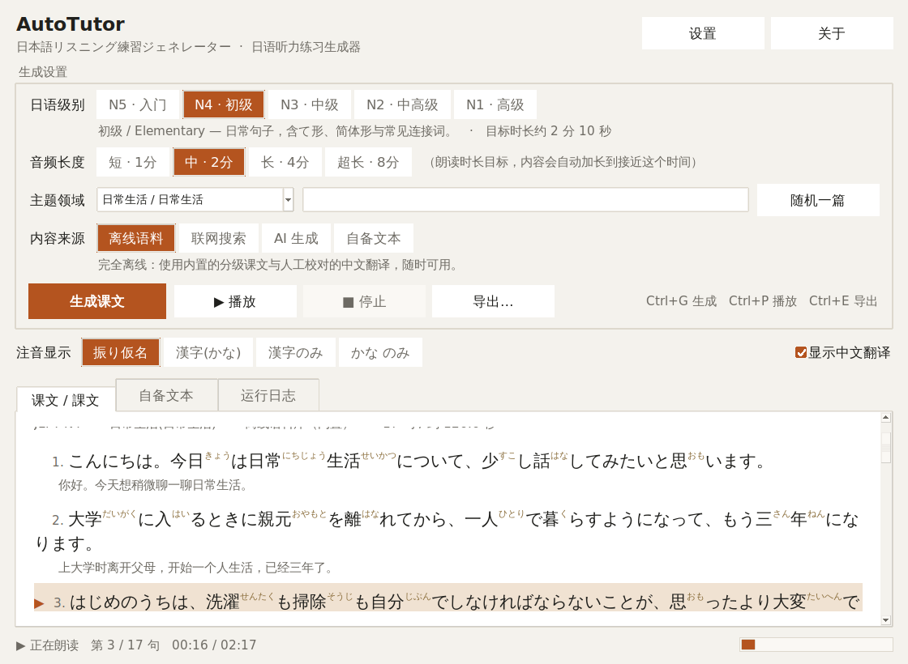
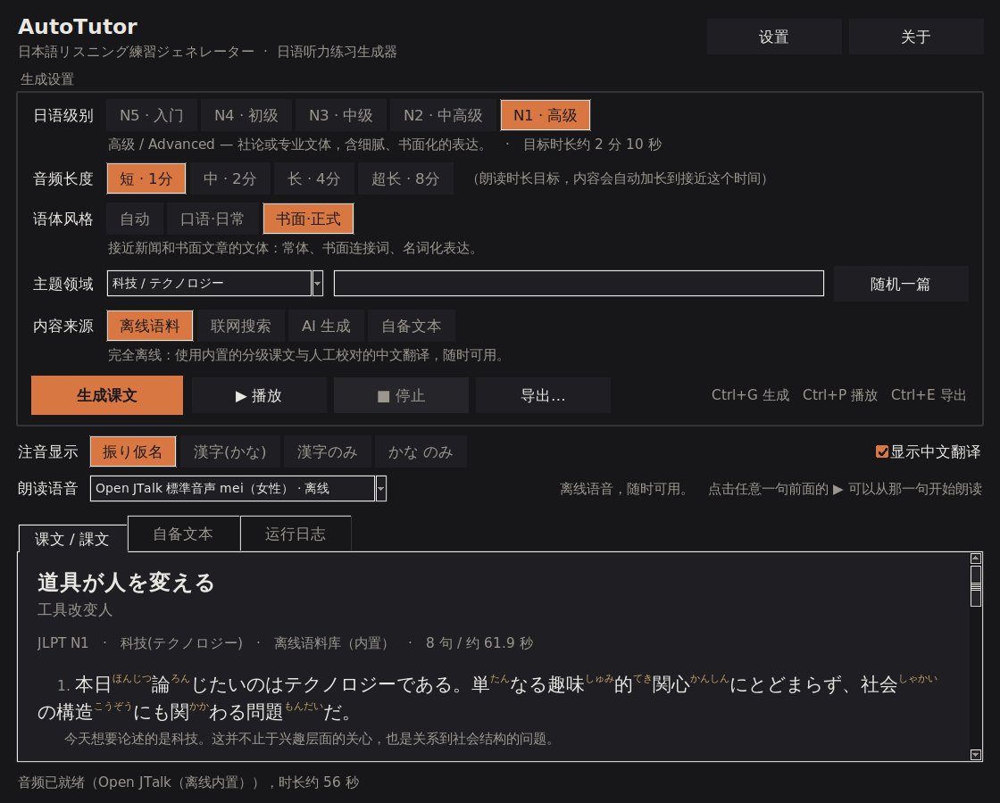
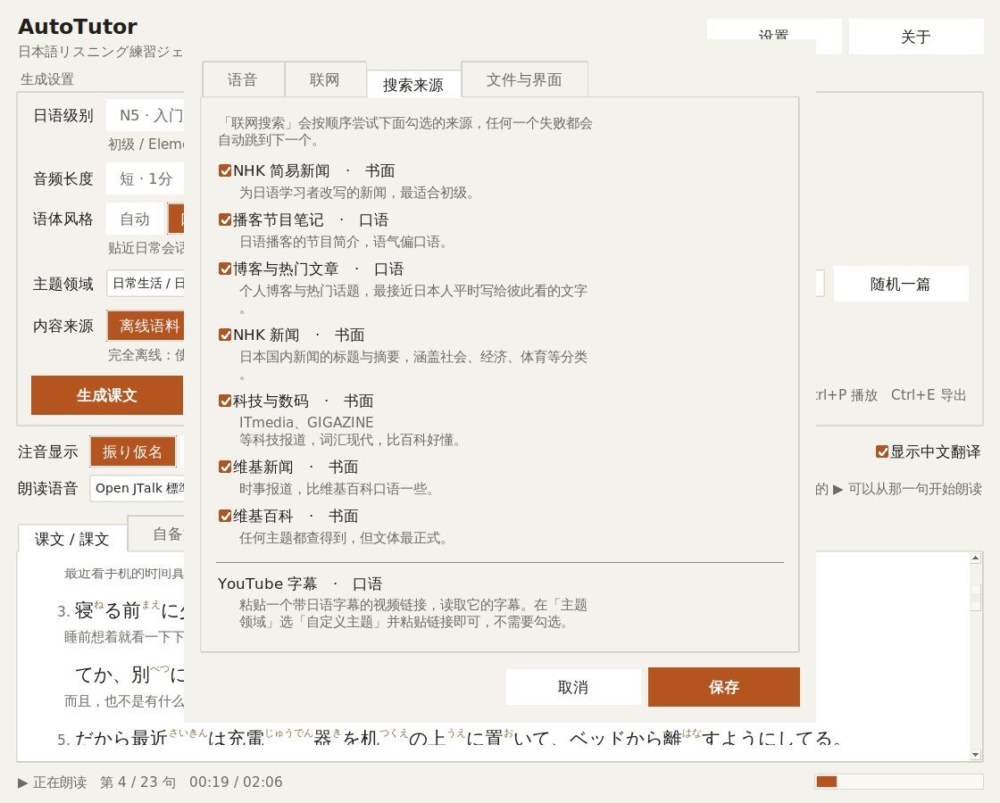
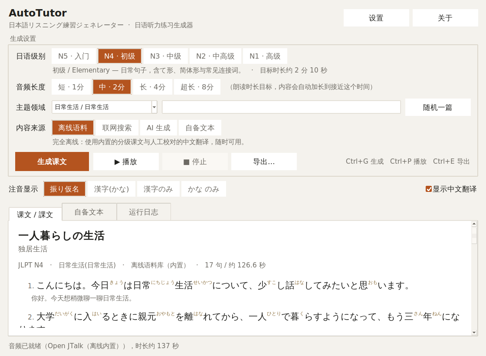

# AutoTutor — 日语听力练习生成器

> Generate graded Japanese listening practice: passages with **furigana over every kanji**,
> a **Chinese translation**, and a **clear Japanese narration you can export as MP3** —
> entirely offline if you want it to be.



Pick your JLPT level and the field you care about (daily life, games, anime, programming,
hospital, …), press one button, and you get a short talk in Japanese, annotated and read
aloud. Everything works with the network cable unplugged; going online is opt-in and only
adds extra sources.

---

## Contents

- [What you get](#what-you-get)
- [Quick start](#quick-start)
- [Using it](#using-it)
- [Content sources](#content-sources)
- [Exports](#exports)
- [Building the .exe](#building-the-exe)
- [Command line](#command-line)
- [How it works](#how-it-works)
- [Troubleshooting](#troubleshooting)
- [Project layout](#project-layout)
- [Licences and credits](#licences-and-credits)

---

## What you get

| | |
|---|---|
| **Level-aware content** | JLPT **N5 → N1**. Vocabulary, grammar and sentence length all change with the level, and the narration slows down for beginners. Passages are developed paragraphs, not lists of one-line facts. |
| **15 topic fields** | Daily life · Food · Travel · School · Work · Shopping · Hospital · Games · Anime & manga · Programming · Technology · Sports · Music · Weather · Japanese culture — plus *random* and *free-text* topics. |
| **Furigana on every kanji** | Readings come from the same Open JTalk dictionary that produces the audio, so what you read is exactly what you hear. Four display modes: ruby, `漢字(かんじ)`, kanji only, kana only. |
| **Chinese translation** | The 750 bundled sentences ship with hand-written Simplified Chinese. Web and custom text are translated online. |
| **Pick the length you want** | Four targets — about **1, 2, 4 or 8 minutes** of narration. The composer keeps adding material, with spoken transitions, until it reaches the target. |
| **Clear narration → MP3** | Offline Open JTalk voice, Windows system voices, or Microsoft Edge neural voices. Adjustable speed, sentence pauses and per-sentence repeats. |
| **Follow along while it reads** | The sentence being spoken is marked with a ▶ in the gutter and highlighted, and the status bar shows `第 3 / 17 句　00:16 / 02:17` with a progress bar. |
| **Truly offline** | The voice model and dictionary are bundled *inside* the executable. No account, no API key, no download on first run. |
| **Optional online mode** | Search NHK News Web Easy and Japanese Wikipedia for real articles, filtered to your level. |

<details>
<summary>Dark theme &amp; settings (click to expand)</summary>





</details>

---

## Quick start

### Option A — download the executable

Grab `AutoTutor.exe` from the [Releases page](../../releases), or from the
**Artifacts** section of the latest [Build workflow run](../../actions/workflows/build.yml).
Double-click it. There is nothing to install.

> The file is ~150–200 MB because the Japanese dictionary (103 MB) and the voice model
> travel inside it — that is what makes offline narration possible.

### Option B — run from source

```bash
git clone https://github.com/Evergarden0101/AutoTutor.git
cd AutoTutor
python -m venv .venv
source .venv/bin/activate          # Windows: .venv\Scripts\activate
pip install -r requirements.txt
python -m autotutor
```

Requires **Python 3.9 – 3.14** with Tk. Windows and macOS installers from python.org
include Tk; on Debian/Ubuntu run `sudo apt install python3-tk`.

---

## Using it

1. **日语级别** — choose N5 … N1. The hint line under the buttons tells you what that
   level means in practice.
2. **主题领域** — pick a bundled topic, `— 随机主题 —` for a surprise, or
   `— 自定义主题 —` and type anything you like.
3. **音频长度** — how long you want the narration to be: 短 (~1 min), 中 (~2 min), 长 (~4 min) or 超长 (~8 min).
4. **内容来源** — see [Content sources](#content-sources) below.
5. Press **生成课文** (or `Ctrl+G`). The text appears immediately and the audio is
   synthesised in the background.
6. **▶ 播放** (`Ctrl+P`) reads it aloud, marking and highlighting the sentence being spoken and showing elapsed/total time.
7. **导出…** (`Ctrl+E`) writes the MP3 and study materials wherever you want.

The **注音显示** row switches between furigana, `漢字(かんじ)`, plain kanji and kana-only —
useful for testing yourself: listen first with the kanji hidden, then reveal.

---

## Content sources

| Mode | Network | What it does |
|---|---|---|
| **离线语料** | never | Composes a talk from the bundled corpus: a level-appropriate opening, one or more themed passages joined by spoken transitions, and a closing line — enough material to fill the length you asked for. Every sentence has a human-written Chinese translation. |
| **联网搜索** | required | Searches **NHK News Web Easy** (for N5/N4) and **Japanese Wikipedia**, splits articles into sentences, and slides a window across them to find the passage closest to your level. Translated automatically. |
| **AI 生成** | required + API key | Asks Claude to write a brand-new passage at exactly your level about any topic. Set the key in **设置 → 联网**. |
| **自备文本** | optional | Paste your own Japanese into the 自备文本 tab and get furigana, translation and audio for it. |

**Every online mode degrades gracefully.** If the search fails, the API key is missing, or
the network is down, AutoTutor falls back to the offline corpus and tells you why in the
lesson notes and the 运行日志 tab. You never end up with nothing.

Online features are **off by default** — enable them in **设置 → 联网 → 允许联网**.

---

## Exports

**导出…** lets you pick any combination of:

| File | Contents |
|---|---|
| `.mp3` | The narration. (`.wav` is also available for the offline engines.) |
| `.txt` | A study sheet: furigana text, kana-only text, Chinese translation, vocabulary list. |
| `.html` | The same lesson with **real `<ruby>` furigana**, styled for reading and printing, light/dark aware. |
| `.srt` | Per-sentence subtitles with real timings — drop it next to the MP3 in any player. |
| `.json` | The structured lesson, if you want to process it yourself. |

---

## Building the .exe

On **Windows**, double-click **`build.bat`**. It creates a virtual environment, installs
everything, runs the tests and produces `dist\AutoTutor.exe`.

Or manually, on any platform:

```bash
pip install -r requirements.txt pyinstaller
python build_exe.py --clean
```

`build_exe.py` checks the toolchain, regenerates the icon and drives
[`AutoTutor.spec`](AutoTutor.spec), which bundles the corpus, the Open JTalk dictionary and
the HTS voice.

**No Windows machine?** Push to GitHub — the
[`Build` workflow](.github/workflows/build.yml) runs the tests on Linux and Windows, builds
`AutoTutor.exe` on `windows-latest`, and uploads it as a downloadable artifact. Publishing
a GitHub release also attaches the exe to it.

> PyInstaller cannot cross-compile: a Windows `.exe` must be built on Windows (or in the
> CI job above). Running `build_exe.py` on Linux produces a Linux binary.

---

## Command line

Useful for batch-generating practice material:

```bash
# One N4 lesson about anime (~2 minutes of audio), exported to ./out
python -m autotutor --cli --level N4 --topic anime --length medium --out ./out

# An 8-minute listening session
python -m autotutor --cli --level N3 --topic technology --length xlong

# A random topic, reproducible via --seed
python -m autotutor --cli --level N5 --topic random --seed 42

# Free-text topic through the online search
python -m autotutor --cli --level N3 --topic "宇宙開発" --source online

# Text only, no synthesis
python -m autotutor --cli --level N2 --topic work --no-audio
```

---

## How it works

```
autotutor/
  levels.py      difficulty model          topics.py     topic registry
  reading.py     furigana alignment        translate.py  ja→zh back-ends
  content/       offline · online · llm    tts/          openjtalk · sapi5 · edge
  export.py      mp3 / txt / html / srt    ui/           tkinter interface
```

**Furigana.** Text is tokenised by `pyopenjtalk.run_frontend` (falling back to
fugashi+UniDic, then pykakasi). Each token's katakana reading is aligned back onto its
surface so that okurigana stays outside the ruby — `食べます` + `タベマス` becomes
`食(た)べます`, not `食べます(たべます)`. A small override table fixes readings the
analysers get wrong in isolation (`日本語` → にほんご, `二人` → ふたり, `七時` → しちじ).

**Difficulty.** `score_text()` is a four-feature linear model — kanji sophistication,
sentence length, compound-word density, and whether the text uses plain written style
instead of です/ます. The weights were fitted by least squares against the 750
level-labelled corpus sentences; it explains 82 % of the variance there and lands within
one JLPT level 95 % of the time. It drives the online window picker and the "this text is
harder than your level" warning.

**Length.** Narration speed was measured against the bundled voice at 6.9 kana/second, so
a target duration converts directly into an amount of text. The offline composer widens
its search in a fixed order — more passages on the topic, then neighbouring levels of the
same topic, then a related topic — and says in the lesson notes whenever it had to step
outside the level you asked for. The online search grows its window and merges further
articles the same way.

*Honest limitation:* surface statistics barely separate N2 from N1 — both score around
4.4. Treat the estimate as a ranking signal, not a verdict.

**Audio.** Each sentence is synthesised separately, so the app can insert pauses, repeat
sentences, track per-sentence timings (used for the SRT export and the playback
highlight), and keep going if one sentence fails. PCM is encoded to MP3 with LAME via the
`lameenc` wheel — no ffmpeg needed.

---

## Troubleshooting

**"没有任何可用的语音引擎"** — `pyopenjtalk` did not import. Run
`pip install pyopenjtalk-plus`. Prebuilt wheels exist for CPython 3.9–3.14 on Windows,
macOS and Linux.

**Windows 内置语音 is unavailable** — Windows has no Japanese voice installed. Add one in
*Settings → Time & language → Speech → Manage voices → Add voices → 日本語*. Or just use
the bundled Open JTalk engine, which needs nothing.

**Playback does nothing on Linux** — install a player: `sudo apt install ffmpeg` (or
`mpg123`). Windows and macOS work out of the box. Exporting the MP3 always works
regardless.

**The GUI will not start** — Tk is missing. `sudo apt install python3-tk` on
Debian/Ubuntu, or use `--cli`.

**Online search fails** — check **设置 → 联网 → 允许联网** is on. Corporate networks and
some regions block `ja.wikipedia.org` and `www3.nhk.or.jp`; the app falls back to the
offline corpus and says so in 运行日志.

**Furigana looks wrong for one word** — add it to `READING_OVERRIDES` in
[`autotutor/reading.py`](autotutor/reading.py).

---

## Project layout

```
AutoTutor/
├── autotutor/
│   ├── app.py                GUI + CLI entry point
│   ├── config.py             paths, persisted settings
│   ├── levels.py             JLPT levels, calibrated difficulty model
│   ├── models.py             Sentence / Lesson / GenerationRequest
│   ├── reading.py            furigana engines and alignment
│   ├── translate.py          Claude / Google / MyMemory back-ends
│   ├── export.py             mp3, txt, html-with-ruby, srt, json
│   ├── net.py                stdlib-only HTTP helper
│   ├── console.py            UTF-8 stdio on legacy Windows code pages
│   ├── content/              corpus · offline · online · llm · service
│   ├── tts/                  audio · openjtalk · sapi5 · edge
│   ├── ui/                   main_window · widgets · settings · theme
│   └── data/corpus/          15 topics × 5 levels, 750 sentences
├── tests/                    258 tests
├── assets/make_icon.py       dependency-free icon generator
├── AutoTutor.spec            PyInstaller build
├── build_exe.py / build.bat  one-command builds
└── .github/workflows/        tests + Windows exe artifact
```

Run the tests with `python -m pytest -q tests`.

---

## Licences and credits

AutoTutor itself is released under the **MIT Licence** (see [LICENSE](LICENSE)).

It stands on:

- **[Open JTalk](http://open-jtalk.sourceforge.net/)** / **[pyopenjtalk-plus](https://pypi.org/project/pyopenjtalk-plus/)** —
  Japanese speech synthesis and the dictionary used for furigana. Open JTalk is distributed
  under a modified BSD licence.
- **MMDAgent "mei" voice** — the bundled HTS voice, distributed under the
  [Creative Commons Attribution 3.0](https://creativecommons.org/licenses/by/3.0/) licence
  by the MMDAgent project (Nagoya Institute of Technology).
- **[LAME](https://lame.sourceforge.io/)** via `lameenc` — MP3 encoding (LGPL).
- **[pykakasi](https://codeberg.org/miurahr/pykakasi)** — fallback kana conversion (GPL-3.0;
  used only as a fallback and imported dynamically).
- **NHK News Web Easy** and **Japanese Wikipedia** — sources for the optional online mode.
  Fetched content belongs to its respective rights holders; the app links back to every
  article it uses. Wikipedia text is CC BY-SA.

The bundled corpus (750 Japanese sentences with Chinese translations) was written for this
project and is covered by the project licence.
